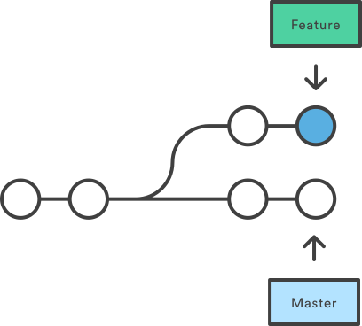
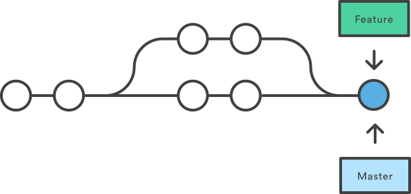
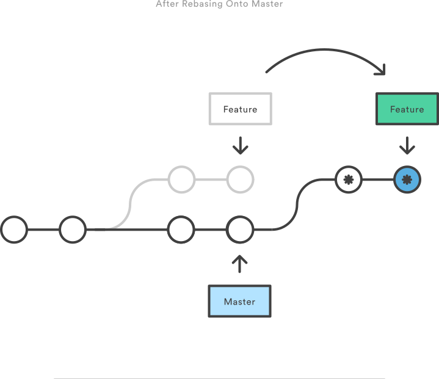
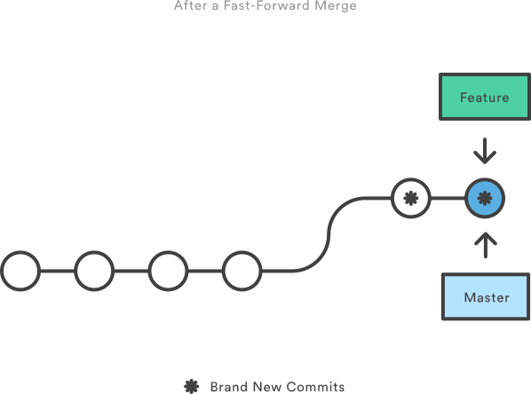

# 1. Basics
## 1.1 Git from an existing local directory
Init a git repositery in an existing directory:
```git
git init
```

Add a file in the repositery :
```git
git add Makefile
```

If we check the status you will see that Makefile is added but not the other
files :
```git
git status
```

Add multiple files :
```git
git add license.txt LICENSE
git add *
```

By checking again the status, you will see that all the files are added but not
commited :
files :
```git
git status
```

Commit the modification :
```git
git commit
```

Now, all files are commited :
```git
git status
```

The files are localy commited on master but we need to push the changes on the
distant repositery. If we try to push master, Git will tell you that
it doesn't know the distant repositery :
```git
git push
```

If the repositery is on Github, we can add it by doing :
```git
git remote add origin git@github.com:username/repository.git
```

Now if we push, we will have another message saying that the branch doesn't
exist on GitHub :
```git
git push
```

We need to specify where to push by specifying origin :
```git
git push --set-upstream origin master
```

## 1.2 Git from a distant repositery
If the repositery already exists you can clone it:
```git
git clone git@github.com:/repository.git
```
If you don't have the push rights, you will have to create a copy of the
repositery. On Github you can fork easily by clicking on the fork button.

## 1.3 Git branches
Since now, we have only a branch called master but we can create another. Thus,
if we want to modify something or add a new feature on our code, we create a
new branch.

To create a branch :
```git
git branch branch_name
```

Show all the branches on a repositery :
```git
git branch
```

Change the branch :
```git
git checkout branch_name
```

After we have done all the modification we need, we will push the
modification on the branch. For that we add and commit the files :
```git
git add README.md
git commit
```

To commit all the modified files, it's possible to commit all at once :
```git
git commit -a
```

If the only change I have done is a small fix and I don't want to add a
specific commit for that, I can add the modifications to the previous commit :
```git
git commit -a --amend
```

As before the branch is only local, if I want to share it with someone else :
```git
git push --set-upstream origin test
```

## 1.4 Fetch the data from a distant branch
If I want to copy the data from a distant branch :
```git
git fetch origin branch-name
```
This command will put branch-name in memory on a virtual branch FETCH_HEAD.
If I want to create a local copy of FETCH_HEAD :
```git
git commit -b copy_name FETCH_HEAD
```

If someone else has pushed some changes on the distant branch, I can
recover them :
```git
git fetch origin branch-name
git rebase origin/branch-name
```

### What is the difference between rebase and merge ?
Let's consider the following case :



The merge command will push the commit of the second branch onto master.
You must be carreful of what you're doing with merge. This can create
difficult case to manage :
```git
git merge branch_origin branch_destination
```


If we do a rebase, we change the origin of our second branch to be the end of
the another branch. With that we can conserve all the previous commit :
```git
git rebase branch_origin branch_destination
```


As things can be difficult to manage, we advise you to use a rebase before
any merge (if it is possible) :

**This advice is not universal but work for simple projects**.

It possible to remove, squash any of the commit by :
```git
git rebase -i branch_name
```

If I want to do it for the previous commit on my branch :
```git
git rebase -i HEAD~8
```

### Solve conflicts
When you try a rebase, some conflicts can be launched. You must solve the
problem and then says to git they are solved:
```git
git add conflict_file
git rebase --continue
```

As we said before, it's better to merge a branch only they are rebased.
In that way, it's easier to solve the conflicts and on that way we can conserve
all the successive modification.

### GitHub
GitHub gives you a lot of tools that can be usefull to manage your projects :
- [Report issues](https://guides.github.com/features/issues/)
- [Pull request](https://help.github.com/articles/creating-a-pull-request/)
- [Integration tools](https://github.com/integrations)

And a lot of other features.

### Git configuration
You can define some personal git properties (as alias, ...). To do that,
you have to create a file called ``~/.gitconfig``.

We provide an example of a gitconfig file :
```
[color]
  branch = true
  diff = true
  interactive = true
  ui = true
  status = true

[core]
  editor = vim
  preloadindex = true
  autocrlf = false
  whitespace = trailing-space,space-before-tab,indent-with-non-space

[alias]
  ci = commit
  co = checkout
  st = status
  br = branch

[user]
  name = User Name
  email = user.name@organisation.com

[push]
  default = simple
```
